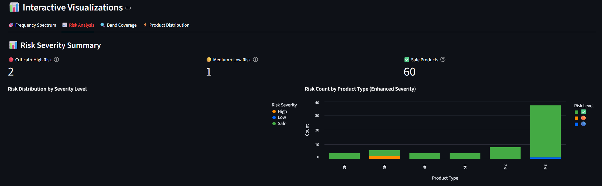
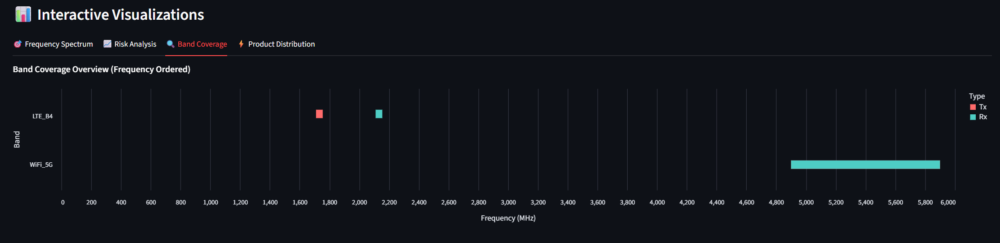
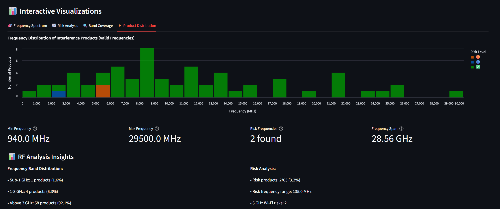

# RF Spectrum Interference Calculator

A professional RF engineering tool for analyzing interference, harmonics, and intermodulation products across 70+ wireless bands with **comprehensive RF system performance analysis**.

## 📊 What's New in v1.8.0 - Production Ready RF Analysis
- **🔬 Quantitative Analysis**: Real interference power calculations with proper harmonic/IMD modeling
- **🛠️ Comprehensive System Parameters**: Full RF system modeling with isolation, filtering, and nonlinearity
- **📱 Industry Presets**: Professional system configurations (mobile, IoT, base station, laboratory)
- **📊 Advanced Metrics**: Complete interference analysis with desensitization, margins, and risk assessment
- **🎯 Engineering Results**: Actual dBm levels, professional risk analysis, design guidance
- **⚡ Complete RF Workflow**: From frequency planning to engineering validation

## 🔧 Professional Use Cases
- **📐 RF System Design**: Predict interference performance before hardware development
- **🔍 Pre-hardware Validation**: Validate coexistence with quantitative analysis
- **📋 Regulatory Analysis**: Professional interference studies with industry-standard methods
- **🛠️ Design Optimization**: Specific engineering recommendations for isolation and filtering
- **🎓 Engineering Training**: Standard RF calculations and professional methodology

## 🚀 Key Features
- **70+ Wireless Bands**: LTE, Wi-Fi, BLE, GNSS, ISM and more
- **Complete IMD Analysis**: IM2, IM3, IM4, IM5, IM7 + Harmonics (2H-5H)
- **🔬 RF Performance Analysis**: Real signal levels, margins, and performance impact
- **Risk Assessment**: Automatic severity analysis with color-coded alerts
- **Interactive Charts**: Frequency spectrum, risk analysis, band coverage
- **Professional Export**: CSV, Excel, JSON with timestamps
- **Real-time Analysis**: Instant interference calculations and warnings

## ⭐ **Professional RF Performance Analysis**

Transform frequency conflicts into **actionable engineering data**:

### **🎯 Professional Signal-Level Analysis**
- **P_IM3 = 2×P_in - IIP3** calculations using industry-standard formulas
- **Real interference power levels** at victim inputs (dBm)
- **Performance margins** vs sensitivity thresholds
- **PER estimates** for different modulation schemes

### **🛠️ System Parameter Configuration**
Choose from professional presets or customize:
- **📱 Mobile Device**: 20dB isolation, -12dBm IIP3, 23dBm LTE
- **📡 IoT Gateway**: 35dB isolation, -18dBm IIP3, 20dBm LTE  
- **🚗 Automotive**: 25dB isolation, -10dBm IIP3, 27dBm LTE

### **📊 Enhanced Results**
| Type | Freq | Aggressor→Victim | **Power** | **Margin** | **Impact** | **PER** |
|------|------|------------------|-----------|------------|------------|---------|
| IM3  | 2442 | LTE+BLE→WiFi    | **-42dBm** | **8dB**    | **Medium** | **5%**  |

### **🎯 How to Access**
1. Run standard interference analysis
2. Click **"🔬 Performance Report"** button  
3. Configure system parameters
4. Click **"🚀 Run Performance Analysis"**
5. Get real signal levels and optimization recommendations

## 🔍 Critical Interference Examples

### 1. GPS Safety Risk

**LTE Band 13** (777-787 MHz) **→ GPS L1** (1575 MHz)  
- **Product**: 2nd Harmonic @ 1574 MHz 🔴  
- **Impact**: GPS navigation interference
- **Formula**: `2×787 MHz = 1574 MHz` (exactly hits GPS L1 at 1575.42 MHz)

### 2. Wi-Fi 5G Performance Impact

**LTE Band 4** (1710-1755 MHz) **→ Wi-Fi 5G** (5150-5925 MHz)
- **Product**: 3rd Harmonic @ 5265 MHz 🟠
- **Impact**: Wi-Fi channel blocking
- **Formula**: `3×1755 MHz = 5265 MHz` (hits Wi-Fi 5G channels)

#### Detailed Analysis Views:

**Frequency Spectrum**: Interactive scatter plot showing interference products across frequency bands

 
**Risk Analysis**: Severity breakdown and critical product identification with color-coded alerts


**Band Coverage**: Visual frequency allocation showing transmit/receive band relationships


**Product Distribution**: Frequency histogram of all interference products with risk-based coloring

### 3. ISM Band Conflicts
 
**LTE Band 26** (814-849 MHz) **→ Wi-Fi 2.4G/BLE** (2400-2500 MHz)
- **Product**: 3rd Harmonic @ 2442 MHz 🔴
- **Impact**: BLE and Wi-Fi 2.4G interference
- **Formula**: `3×814 MHz = 2442 MHz` (hits ISM band center)

> 📖 **Complete screenshot documentation**: See [screenshots/README.md](screenshots/README.md) for detailed scenario explanations and configuration instructions.

## 🚀 Quick Start
```bash
# Install dependencies
pip install streamlit pandas altair openpyxl

# Run the application  
streamlit run ui.py
```

**Basic Usage:**
1. Select band categories and specific bands
2. Configure guard margins and analysis products
3. Click "Calculate Interference" 
4. Review critical results and export data

**🔬 NEW: Performance Analysis Workflow:**
1. Complete basic interference analysis (above)
2. Click **"🔬 Performance Report"** button
3. Configure system parameters (presets available)
4. Click **"🚀 Run Performance Analysis"**
5. Get **real signal levels, margins, and optimization recommendations**

## 📊 Interactive Analysis Features

The application provides four comprehensive analysis views (shown above for LTE B4 → Wi-Fi 5G scenario):

### Four Analysis Views:
- **🎯 Frequency Spectrum**: Interactive scatter plot showing all interference products positioned by frequency and risk level
- **📈 Risk Analysis**: Pie chart showing severity distribution with color-coded risk categories and critical product counts  
- **🔍 Band Coverage**: Visual frequency allocation chart displaying transmit/receive band relationships and overlaps
- **⚡ Product Distribution**: Histogram showing frequency distribution of interference products with risk-based coloring

Each view provides different insights:
- **Spectrum view**: Identifies exact interference frequencies and victim bands
- **Risk view**: Prioritizes critical products requiring immediate attention  
- **Coverage view**: Shows band relationships and potential conflicts
- **Distribution view**: Reveals interference concentration across frequency ranges

## � What's New in v1.4.3
- **Enhanced Screenshots**: Added professional example scenarios with visual documentation
- **Simplified UI**: Streamlined interface with clearer critical risk identification
- **Improved Charts**: Fixed Product Distribution visualization with proper risk symbol handling
- **Professional Examples**: Real-world GPS, Wi-Fi, and BLE interference scenarios
- **Code Quality**: Cleaned debug code, optimized imports, enhanced error handling

## 🔧 Professional Use Cases
- **Product Development**: Validate RF design choices and coexistence
- **Regulatory Submissions**: Generate interference analysis reports  
- **Customer Support**: Demonstrate and troubleshoot interference issues
- **Training**: Real-world RF engineering examples and calculations

## 📈 Versioning
Current version: **v1.8.0** - Production Ready RF Analysis with comprehensive interference calculations and professional reporting

Previous releases: [CHANGELOG.md](CHANGELOG.md)

## Authors
Adam Engelbrecht (RFingAdam)

## 📄 License
GNU General Public License v3.0 (GPL-3.0) - Free for personal, educational, and commercial use with source sharing requirements.

---
*Professional RF interference analysis tool for engineering and regulatory compliance.*
