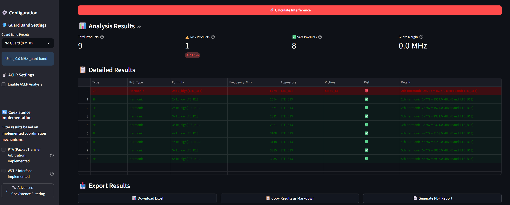
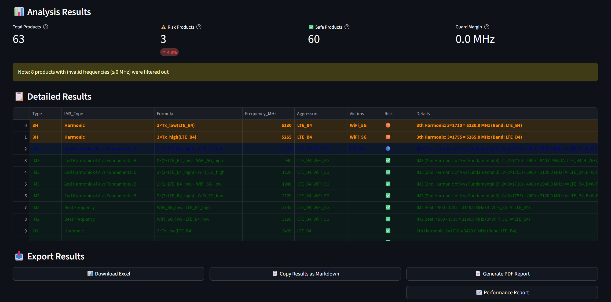
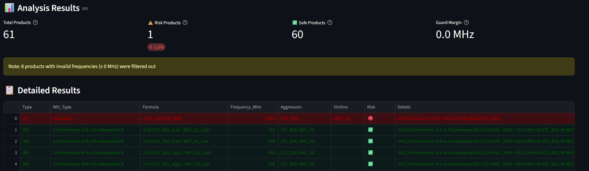
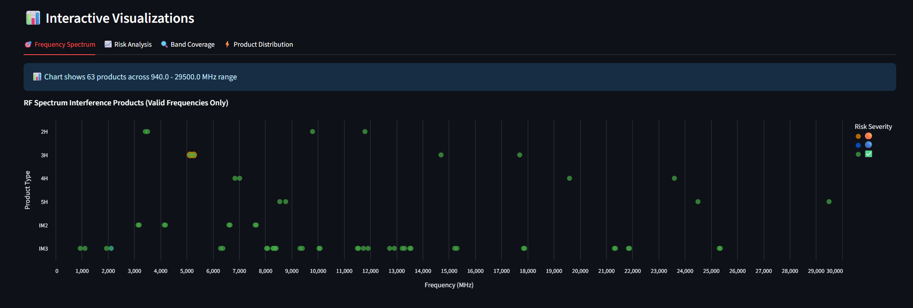

# RF Spectrum Interference Calculator

A professional RF tool for analyzing interference, harmonics, and intermodulation products across 70+ wireless bands.

## 🚀 Key Features
- **70+ Wireless Bands**: LTE, Wi-Fi, BLE, GNSS, ISM and more
- **Complete IMD Analysis**: IM2, IM3, IM4, IM5, IM7 + Harmonics (2H-5H)
- **Risk Assessment**: Automatic severity analysis with color-coded alerts
- **Interactive Charts**: Frequency spectrum, risk analysis, band coverage
- **Professional Export**: CSV, Excel, JSON with timestamps
- **Real-time Analysis**: Instant interference calculations and warnings

## 🔍 Critical Interference Examples

### 1. GPS Safety Risk

**LTE Band 13** (777-787 MHz) **→ GPS L1** (1575 MHz)  
- **Product**: 2nd Harmonic @ 1574 MHz 🔴  
- **Impact**: GPS navigation interference

### 2. Wi-Fi 5G Performance  

**LTE Band 4** (1710-1755 MHz) **→ Wi-Fi 5G** (5150-5925 MHz)
- **Product**: 3rd Harmonic @ 5265 MHz 🟠
- **Impact**: Wi-Fi channel blocking

### 3. ISM Band Conflicts
 
**LTE Band 26** (814-849 MHz) **→ Wi-Fi 2.4G/BLE** (2400-2500 MHz)
- **Product**: 3rd Harmonic @ 2442 MHz 🔴
- **Impact**: BLE and Wi-Fi 2.4G interference

## 🚀 Quick Start
```bash
# Install dependencies
pip install streamlit pandas altair openpyxl

# Run the application  
streamlit run ui.py
```

**Usage:**
1. Select band categories and specific bands
2. Configure guard margins and analysis products
3. Click "Calculate Interference" 
4. Review critical results and export data

## 📊 Interactive Analysis Features



### Four Analysis Views:
- **🎯 Frequency Spectrum**: Interactive scatter plot of all interference products
- **📈 Risk Analysis**: Severity distribution and critical product identification  
- **🔍 Band Coverage**: Visual band layout and frequency allocation
- **⚡ Product Distribution**: Histogram of interference product frequencies

## � What's New in v1.4.3
- **Enhanced Screenshots**: Added professional example scenarios with visual documentation
- **Simplified UI**: Streamlined interface with clearer critical risk identification
- **Improved Charts**: Fixed Product Distribution visualization with proper risk symbol handling
- **Professional Examples**: Real-world GPS, Wi-Fi, and BLE interference scenarios
- **Code Quality**: Cleaned debug code, optimized imports, enhanced error handling

## 🔧 Professional Use Cases
- **Product Development**: Validate RF design choices and coexistence
- **Regulatory Submissions**: Generate interference analysis reports  
- **Customer Support**: Demonstrate and troubleshoot interference issues
- **Training**: Real-world RF engineering examples and calculations

## 📈 Versioning
Current version: **v1.4.3** - Enhanced visual documentation and simplified interface

Previous releases: [CHANGELOG.md](CHANGELOG.md)

## Authors
Adam Engelbrecht (RFingAdam)

## 📄 License
GNU General Public License v3.0 (GPL-3.0) - Free for personal, educational, and commercial use with source sharing requirements.

---
*Professional RF interference analysis tool for engineering and regulatory compliance.*
